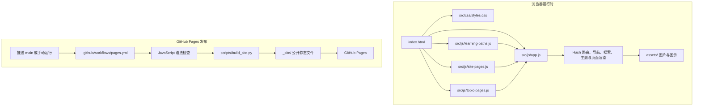

# CQUPT-B306 学习与协作站

CQUPT-B306 是一份面向实验室成员与新成员的中文文档站。它把学习指南、科学提问、GitHub 协作、开发工具、C 语言阶段资料、嵌入式与智能系统专题整理成可直接阅读、可分享链接的网页；也为年度招新、项目展示和活动记录留出独立栏目。

网站使用原生 HTML、CSS 和 JavaScript，没有 npm 依赖或打包步骤。页面以 hash 路由运行，可部署在 GitHub Pages 等静态托管服务。内容按主题拆分，旧年度资料保留独立页面；`docs/` 与 `dcos/` 中的本地原始文件默认忽略，不进入 Git 历史或公开发布包。

源码仓库：<https://github.com/CQUPTB306/B306-lab-resources>

## 架构



## 项目结构

```text
.
├── index.html                 # 网站入口与全局框架
├── src/
│   ├── css/
│   │   └── styles.css         # 全站、桌面与移动端样式
│   └── js/
│       ├── app.js             # 路由、渲染、导航、搜索与主题
│       ├── learning-paths.js  # 学习路径、页面顺序与阅读指南
│       ├── site-pages.js      # 首页、关于、项目、日常等页面
│       └── topic-pages.js     # 技术专题与校园指南
├── assets/
│   ├── brand/                 # 品牌标志
│   ├── projects/              # 项目栏目图示
│   └── topics/                # 专题图示及移动版图示
├── scripts/build_site.py      # 组装仅含公开文件的 Pages 发布包
└── .github/workflows/         # GitHub Actions 检查和部署配置
```

页面脚本在 `index.html` 中按依赖顺序加载：`src/js/learning-paths.js`、`src/js/site-pages.js`、`src/js/topic-pages.js`、`src/js/app.js`。页面内容与路由由 `app.js` 汇总；学习路径提供目录、先备知识、目标、练习和同主题前后页关系。

## 本地预览与检查

在项目根目录启动静态服务器：

```sh
python3 -m http.server 8000
```

打开 <http://localhost:8000>。Windows 可运行 `py -m http.server 8000`。页面使用 hash 路由，静态托管不需要重写规则。

检查 JavaScript 语法：

```sh
node --check src/js/learning-paths.js
node --check src/js/site-pages.js
node --check src/js/topic-pages.js
node --check src/js/app.js
```

生成与预览 Pages 发布包：

```sh
python3 scripts/build_site.py /tmp/b306-pages-preview
python3 -m http.server 8000 --directory /tmp/b306-pages-preview
```

指定的输出目录必须尚不存在，脚本不会覆盖它；不传参数时默认重建 `_site/`。请不要把需要保留的个人文件放进 `_site/`。

## 内容维护

| 内容 | 文件 | 页面示例 |
| --- | --- | --- |
| 学习路径、栏目顺序、阅读准备与练习建议 | `src/js/learning-paths.js` | 文档目录、侧栏、同主题前后页 |
| 首页、关于、项目与日常 | `src/js/site-pages.js` | `#/`、`#/about`、`#/projects` |
| 学习指南、贡献、工具、招新与 C 语言资料 | `src/js/app.js` 的 `pages` | `#/ask`、`#/contribute`、`#/recruit` |
| 技术专题与校园指南 | `src/js/topic-pages.js` | `#/mcu-architecture`、`#/cqupt-survival` |
| 路由、导航、搜索、主题和页面框架 | `src/js/app.js`、`index.html`、`src/css/styles.css` | 全站 |
| 图片与教学图示 | `assets/` | 品牌、项目、技术专题 |

新增或修订文档时，按以下边界维护：

1. 普通页面在对应脚本的 `pages` 对象中编辑 `title`、`lead`、`content`、`toc`。正文是 JavaScript 模板字符串中的 HTML，不是 Markdown；注意反引号、反斜杠和 HTML 转义。
2. 新增教学页面时，在 `src/js/learning-paths.js` 的对应主题中登记页面 ID 和导航名称，并在 `readingGuides` 中填写先备知识、目标、可验证的练习产出和关联页面。
3. 章节标题的 `id` 与 `toc` 项保持一致。站内链接采用 `#/页面ID/章节ID`；修改旧章节名时，在 `src/js/app.js` 的 `chapterAliases` 保留兼容链接。
4. 图示放在 `assets/topics/` 或 `assets/projects/`，检查桌面和手机可读性、替代文本及来源说明。
5. 新增年度内容使用独立页面和来源记录，不覆盖往年页面；资料不全或规则冲突时标为待确认，不推断缺失信息。

## 原始资料与发布边界

`docs/` 与 `dcos/` 用于维护者本地原件，已加入 `.gitignore`。网页只转述经整理的核心内容，并标出来源文件名；原始文件不上传到仓库，也不进入 `_site/`。资料年份依据原件明确日期标注，归档不表示活动已执行或当前正在招募。若网页内容与来源有差异，应说明修订缘由；缺失内容标为待确认。

原件含个人联系方式，网页不转录邮箱、不提供原件下载链接。公开内容不得包含密码、令牌、个人隐私或未经许可的内部资料。首页照片来自 [Annie Spratt / Unsplash](https://unsplash.com/@anniespratt)，仅作配图，不代表 B306 成员或实景，页面已标明。其他外部资料应保留来源与许可信息。

## GitHub Pages

推送 `main` 会触发 `.github/workflows/pages.yml`：先检查 JavaScript 语法，再调用 `scripts/build_site.py` 组装公开发布包并部署。首次发布需由有权限的账号在仓库 **Settings → Pages → Build and deployment** 选择 **GitHub Actions**。部署状态与最终网址可在仓库 Actions 和 Pages 设置中查看。

当前网站地址：<https://cquptb306.github.io/B306-lab-resources/>

## 贡献

从 [CQUPTB306/B306-lab-resources](https://github.com/CQUPTB306/B306-lab-resources) 创建分支并提交 Pull Request。PR 说明变更内容、信息来源和验证方式；维护者检查事实、链接、格式、敏感信息和构建结果后再合并。首次贡献的完整流程见网站的 `#/contribute` 页面。
